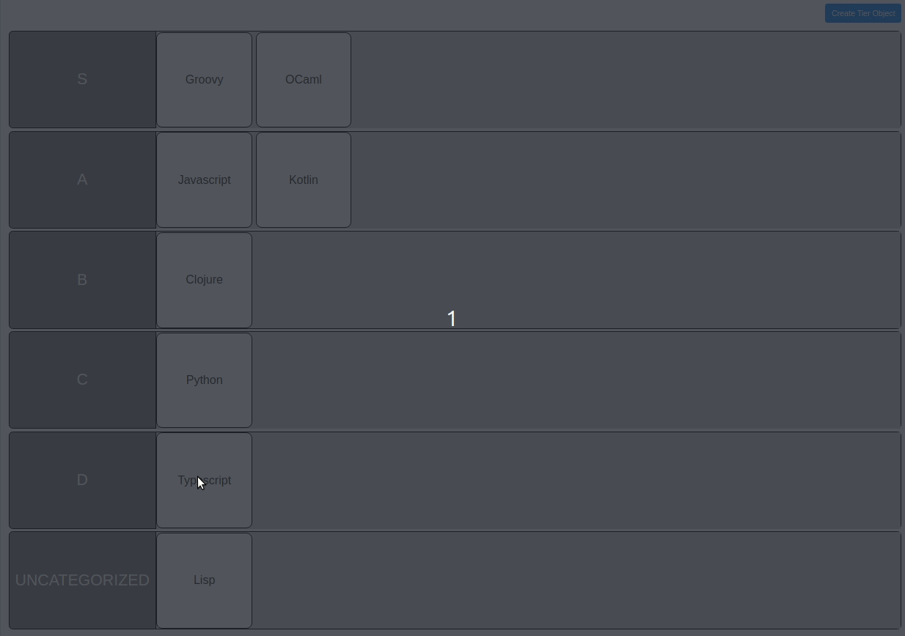

# About

Tier-List web service, build on the AWS serverless stack.  
The serverless backend is implemented in NodeJS, the web client in Angular.

# How to run

Serverless backend:
- Deployable using the AWS SAM cli: `sam build && sam deploy --guided`

Web client:
- Run using npm: `npm install && npm run start`
- Proxy configuration redirects to the AWS API gateway. This requires the env variable `API_TARGET` to be set to the url of the API gateway.

# Demo

